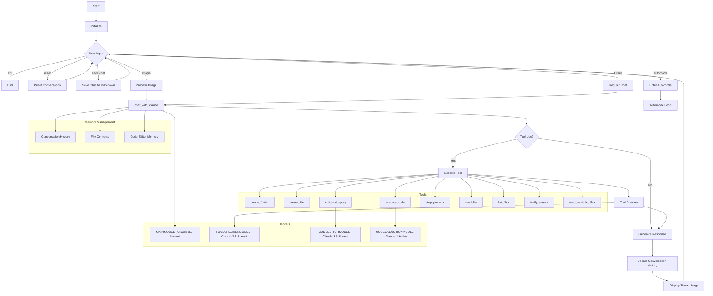

# 🤖 Claude Engineer

Claude Engineer is an advanced interactive command-line interface (CLI) that harnesses the power of Anthropic's Claude 3 and Claude 3.5 models to assist with a wide range of software development tasks. This tool seamlessly combines the capabilities of state-of-the-art large language models with practical file system operations, web search functionality, intelligent code analysis, and execution capabilities.

## NEW

TTS using 11labs WebSockets and audio streaming.
Type
```
11labs on
```
to use TTS and 11labs off to return to regualr mode.

Voice mode 🗣️: Now you can talk to the Engineer directly without even touching your keyboard.

Type
```
voice
```
to enter voice mode.

Say "exit voice mode" to return to regular text.

If you want to use your voice and 11 labs at the same time, first activate 11labs then type voice to use your voice. 

Prompt caching. Make sure you udpate your Anthropic python package before running the script.
```
pip install --upgrade anthropic
```

## ✨ Features

- 💬 Interactive chat interface with Claude 3 and Claude 3.5 models
- 📁 Comprehensive file system operations (create folders, files, read/write files)
- 🔍 Web search capabilities using Tavily API for up-to-date information
- 🌈 Enhanced syntax highlighting for code snippets
- 🏗️ Intelligent project structure creation and management
- 🧐 Advanced code analysis and improvement suggestions
- 🖼️ Image analysis capabilities with support for drag and drop in the terminal
- 🚀 Improved automode for efficient autonomous task completion
- 🔄 Robust iteration tracking and management in automode
- 📊 Precise diff-based file editing for controlled code modifications
- 🛡️ Enhanced error handling and detailed output for tool usage
- 🎨 Color-coded terminal output using Rich library for improved readability
- 🔧 Detailed logging of tool usage and results
- 🔁 Improved file editing workflow with separate read and apply steps
- 🧠 Dynamic system prompt updates based on automode status
- 🔍 TOOLCHECKERMODEL for validating tool usage and outputs
- 📝 CODEEDITORMODEL for specialized code editing tasks
- 🖥️ CODEEXECUTIONMODEL for analyzing code execution results
- 📊 Token usage tracking (input, output, and total) for each model, with improved visualization using tables
- 🪟 Remaining context window display
- 💾 Chat log saving capability
- 🔒 Enhanced code execution capabilities with isolated virtual environment
- 🔄 Process management for long-running code executions
- 📚 Multi-file reading capability for efficient handling of multiple files simultaneously

## 🛠️ Installation

1. Clone this repository:
   ```
   git clone https://github.com/doriandarko/claude-engineer.git
   cd claude-engineer
   ```

2. Install the required dependencies:
   ```
   pip install -r requirements.txt
   ```

3. Set up your environment variables:
   - Create a `.env` file in the project root directory
   - Add the following environment variables:
     ```
     ANTHROPIC_API_KEY=your_anthropic_api_key
     TAVILY_API_KEY=your_tavily_api_key
     ```

4. Set up the virtual environment for code execution:
   Engineer will create a virtual environment to run code the first time it executes a piece of code.
   This is just for you if you want to run the main script in a virtual environment rather than in your default one.
   ```
   python -m venv code_execution_env
   source code_execution_env/bin/activate  # On Windows, use: code_execution_env\Scripts\activate
   pip install -r requirements.txt
   deactivate
   ```

## 🔧 Virtual Environment Setup

Claude Engineer uses a dedicated virtual environment for code execution to ensure isolation and security. The virtual environment is automatically created the first time you run a piece of code. However, if you want to set it up manually or customize it, follow these steps:

1. Create the virtual environment:
   ```
   python -m venv code_execution_env
   ```

2. Activate the virtual environment:
   - On Windows:
     ```
     code_execution_env\Scripts\activate
     ```
   - On macOS and Linux:
     ```
     source code_execution_env/bin/activate
     ```

3. Install the required dependencies:
   ```
   pip install -r requirements.txt
   ```

4. Deactivate the virtual environment when you're done:
   ```
   deactivate
   ```

The code_execution_env virtual environment will be used for all code execution tasks, ensuring a consistent and isolated environment for running user code.

## 🚀 Usage

Run the main script to start the Claude Engineer interface:

```
python main.py
```

Once started, you can interact with Claude Engineer by typing your queries or commands. Some example interactions:

- "Create a new Python project structure for a web application"
- "Explain the code in file.py and suggest improvements"
- "Search for the latest best practices in React development"
- "Help me debug this error: [paste your error message]"
- "Analyze this image and describe its contents"
- "Execute this Python code and analyze the results"
- "Read multiple files: file1.py, file2.py, file3.py"

Special commands:
- Type 'exit' to end the conversation and close the application.
- Type 'image' to include an image in your message for analysis.
- Type 'reset' to reset the entire conversation without restarting the script.
- Type 'automode number' to enter Autonomous mode with a specific number of iterations.
- Type 'save chat' to save the current chat log.
- Press Ctrl+C at any time to exit the automode and return to regular chat.

After each interaction, Claude Engineer will display:
- Token usage (input, output, and total) for the current model
- Remaining context window size

### Code Execution and Process Management

Claude Engineer now supports executing code in an isolated 'code_execution_env' virtual environment:

1. Use the `execute_code` tool to run Python code safely in the isolated environment.
2. Long-running processes can be managed using the process ID returned by `execute_code`.
3. The CODEEXECUTIONMODEL analyzes execution results and provides insights.

### Using Different AI Models

Claude Engineer utilizes multiple specialized AI models:

- MAINMODEL: Claude 3 or Claude 3.5 for general interactions
- TOOLCHECKERMODEL: Validates tool usage and outputs
- CODEEDITORMODEL: Performs specialized code editing tasks
- CODEEXECUTIONMODEL: Analyzes code execution results

The script automatically selects the appropriate model based on the task.

### 🤖 Improved Automode

The enhanced automode allows Claude to work autonomously on complex tasks with greater efficiency and control. When in automode:

1. Claude sets clear, achievable goals based on your request.
2. It works through these goals one by one, using available tools as needed.
3. Claude provides regular updates on its progress, including the current iteration count.
4. Automode continues until goals are completed or the maximum number of iterations is reached.
5. You can specify the maximum number of iterations when entering automode (default is 25).
6. Claude dynamically adjusts its approach based on progress and obstacles encountered.
7. The TOOLCHECKERMODEL validates tool usage and outputs for increased reliability.

To use automode:
1. Type 'automode number' when prompted for input, where number is the maximum number of iterations.
2. Provide your request when prompted.
3. Claude will work autonomously, providing updates after each iteration.
4. Automode exits when the task is completed, after reaching the maximum number of iterations, or when you press Ctrl+C.

### 📊 Enhanced Diff-based File Editing

Claude Engineer now supports an improved diff-based file editing system, allowing for more precise and controlled modifications to existing files. The new workflow includes:

1. Reading the entire content of a file using the `edit_and_apply` function without providing new content.
2. Applying changes to the file using the `edit_and_apply` function with new content, which shows a detailed diff of the proposed changes.
3. Utilizing the CODEEDITORMODEL for specialized code editing tasks, ensuring high-quality modifications.

When editing files, Claude will:

1. Show a detailed diff of the proposed changes, highlighting additions, removals, and unchanged lines with color coding using the Rich library.
2. Focus on adding new code or modifying existing code without unnecessarily removing functionality.
3. Provide a summary of lines added and removed.
4. Apply changes carefully to avoid duplicates and unwanted replacements.
5. Support various editing scenarios, including targeted changes, appending content, inserting at the beginning, and replacing entire file contents.
6. Use the CODEEDITORMODEL to ensure code changes adhere to best practices and maintain consistency.

This feature enhances Claude's ability to make targeted improvements to your codebase while maintaining the integrity of existing functionality.

### 🧠 Dynamic System Prompt

The system prompt is now dynamically updated based on whether the script is in automode or not. This allows for more tailored instructions and behavior depending on the current operating mode:

1. In regular mode, Claude focuses on providing helpful responses and using tools as needed.
2. In automode, Claude is instructed to work autonomously, set goals, and provide regular updates on progress.
3. The system prompt adapts to the specific task at hand, optimizing Claude's performance for each scenario.
4. The system prompt now includes file context for enhanced token management.

The dynamic system prompt enhances Claude's ability to adapt to different scenarios and provide more relevant assistance.

### 📊 Token Management and Visualization

Claude Engineer now features improved token management and visualization:

1. Enhanced token management using file context in the system prompt.
2. Improved token visualization using a table format.
3. Display of input, output, and total token usage for each model interaction.
4. Visualization of remaining context window size.

These improvements provide better insights into token usage and help manage conversations more effectively.

### 🔧 Available Tools

Claude Engineer comes with a set of powerful tools to assist with various tasks:

1. create_folder: Create a new folder at a specified path.
2. create_file: Create a new file at a specified path with content.
3. edit_and_apply: Read the contents of a file, and optionally apply changes.
4. read_file: Read the contents of a file at the specified path.
5. read_multiple_files: Read the contents of multiple files at specified paths.
6. list_files: List all files and directories in the specified folder.
7. tavily_search: Perform a web search using Tavily API to get up-to-date information.
8. execute_code: Run Python code in an isolated virtual environment.
9. stop_process: Manage and stop long-running code executions.
10. TOOLCHECKERMODEL: Validate tool usage and outputs for increased reliability.
11. CODEEDITORMODEL: Perform specialized code editing tasks with high precision.
12. CODEEXECUTIONMODEL: Analyze code execution results and provide insights.

These tools allow Claude to interact with the file system, manage project structures, gather information from the web, perform advanced code editing, and execute code safely.

### 🖼️ Image Analysis

Claude Engineer now supports image analysis capabilities. To use this feature:

1. Type 'image' when prompted for input.
2. Drag and drop your image file into the terminal or provide the file path.
3. Provide a prompt or question about the image.
4. Claude will analyze the image and respond to your query.

This feature enables Claude to assist with tasks involving visual data, such as analyzing diagrams, screenshots, or any other images relevant to your development work.

### 🛡️ Error Handling and Recovery

Claude Engineer implements robust error handling and recovery mechanisms:

1. Graceful handling of API errors and network issues.
2. Automatic retries for transient failures.
3. Clear error messages and suggestions for user action when needed.
4. Logging of errors for debugging and improvement purposes.
5. Ability to recover and continue operation after non-critical errors.
6. Safe termination of long-running processes when needed.

These features ensure a smooth and reliable user experience, even in the face of unexpected issues or complex code executions.

### 💾 Chat Log Saving

You can save the current chat log at any time during your interaction with Claude Engineer:

1. Type 'save' when prompted for input.
2. The chat log will be saved to a file in the current directory with a timestamp in the filename.
3. You can review these logs later for reference or to continue previous conversations.

## 🧠 AI Models and Specialized Agents

Claude Engineer utilizes multiple AI models to provide specialized functionality:

1. MAINMODEL (Claude 3 or Claude 3.5): Handles general interactions and task processing.
2. TOOLCHECKERMODEL: Validates the usage and outputs of various tools to ensure reliability.
3. CODEEDITORMODEL: Specializes in code editing tasks, ensuring high-quality modifications.
4. CODEEXECUTIONMODEL: Analyzes code execution results and provides insights.

These models work together to provide a comprehensive and intelligent development assistance experience.

## Workflow Diagram




## 👥 Contributing

Contributions are welcome! Please feel free to submit a Pull Request. For major changes, please open an issue first to discuss what you would like to change.

## 🦙 Ollama eng is here

You can now have the power of this script, completely locally using Ollama and any of the supported function calling models:
Llama 3.1
Mistral Nemo
Firefunction v2
Command-R +

Before running make sure you install the latest version of the Ollama app and 

```
pip install ollama
```

Then

```
python ollama-eng.py
```

### 🚨Important note on safety when using Ollama Engineer!

Be extra careful if you ever let these local models run code on your machine, especially using the executing code tool. It may brick your machine. I disabled the tool execution completely for OLLAMA engineer but if you want to implement it again based on the original script use at your own discretion.

## Star History

[](https://star-history.com/#Doriandarko/claude-engineer&Date)
